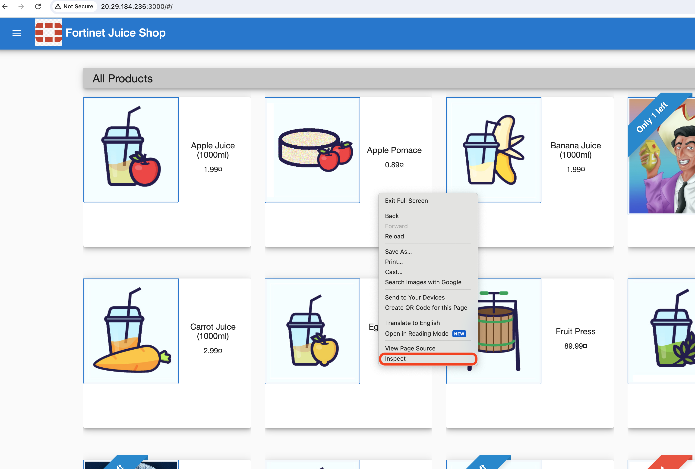
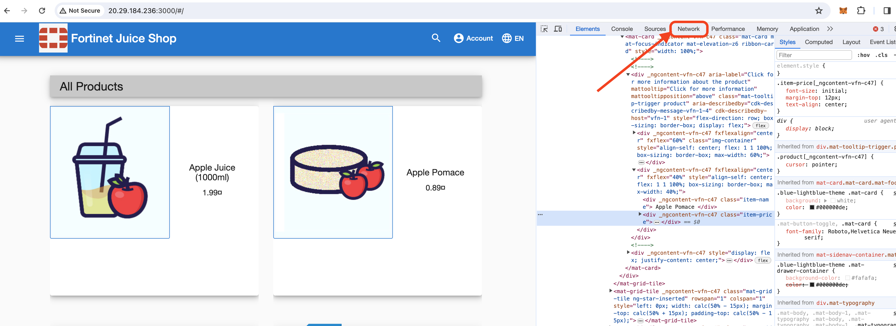
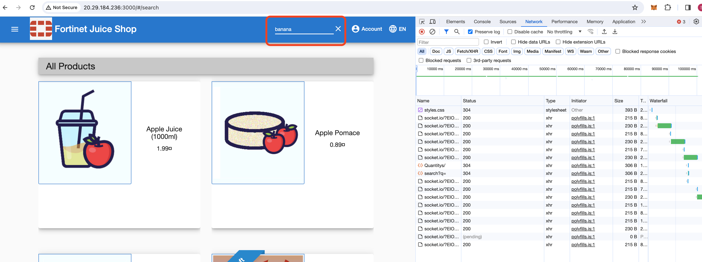
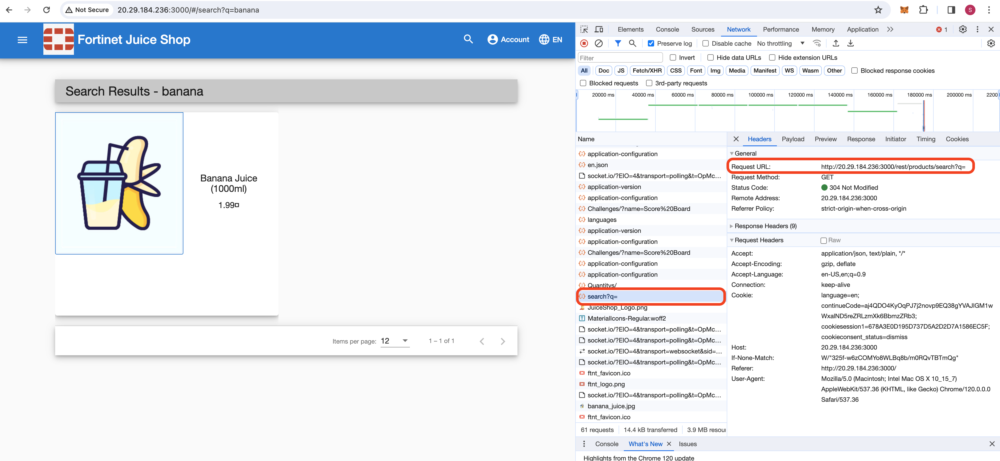
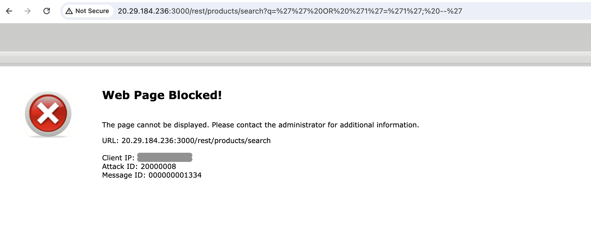
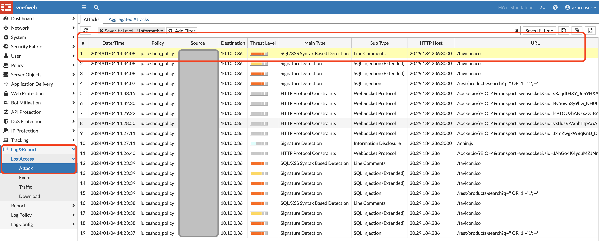

1. lets start with a basic attack first and understand how our signatures work. 

2. SQL injection is one the common Web attack and occurs when an attacker is able to manipulate a website's SQL query by injecting malicious SQL code into user-input fields. 

3. Lets use the common SQL injection paylaod ``'' OR '1'='1'; --'`` to run our attack on Juiceshop webapplication. 

4. Go to the juiceshop website http://fortiwebip:3000 and right click on the web page.Select **Inspect** from the dialog box. it will show us the developer tools. 

    


6. Click **Network** on the console bar of developer tab.

      

7. on the Juiceshop search bar, search for any product for example banana. 

       

8. You will see the inspeection tools show lot of URL's that are being recorded. lets click on the URL that shows  **search?q=** and copy the request URL. 

      

9. The request URL is the API call that is being made to the backend database. lets run the attack on the database by appending the payload above to the API call as shown below. 

      

10. The request will be blocked by Fortiweb VM.

     

11. To check the log on this attack, on Fortiweb VM, **Log and Report >> Log Access >> Attack**

12. You will see the corresponding log about the attack and more information when clicking on specific log entry. 

      

13. Likewise we can test any other payloads from different categories. Now lets try Cross Site scripting(XSS) attack.


14. We can try a different payload on the same url.

    ```http://**FortiwebIP**:3000/rest/products/search?q=<iframe src="javascript:alert(`xss`)">```


15. Notice the attack log on FortiWeb, it shows as XSS attack.  


